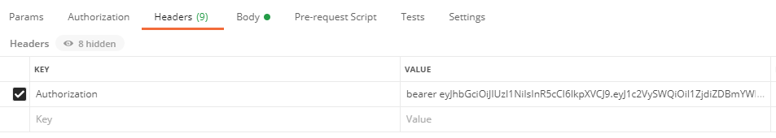
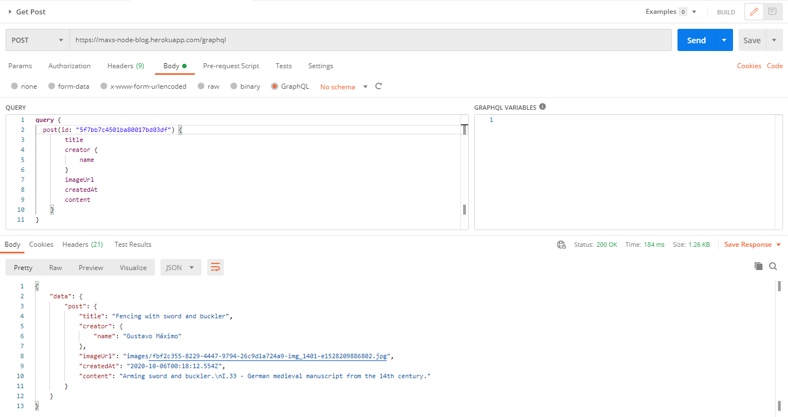

<p align="center">
    
</p>

## Max's Node Blog - Back-End.

> GraphQL/Node.js Learning Project intended to upgrade my back-end skills.

## [:fire: Heroku URL :fire:](https://maxs-node-blog.herokuapp.com/)

## Usage example

This is the back-end for [Max's Node Blog Front-End](https://github.com/GoldenMaximo/React.js-Blog-Frontend). You can access the APIs functionalities through Postman/Insomnia.





### Table of contents

| Queries    | Type     | Required Fields                                       | Auth | Description        |
| ---------- | -------- | ----------------------------------------------------- | ---- | ------------------ |
| createUser | Mutation | email: String! / name: String! / password: String!    | No   | Creates an user.   |
| login      | Query    | email: String! / password: String!                    | No   | Returns JWT token. |
| createPost | Mutation | title: String! / content: String! / imageUrl: String! | Yes  | Creates a Post.    |
| posts      | Query    | page: Int!                                            | Yes  | Gets all posts.    |
| post       | Query    | id: ID!                                               | Yes  | Gets a post.       |

These are some basic methods to play around. The rest can be found under `graphql/schema.js`.

<!-- This is social networking type blog. Create an account, post pictures with descriptions and see other user's posts. -->

## Built With

#### Currently in-use:

- [Node.js](https://nodejs.org/en/) - JavaScript runtime
- [Express.js](https://expressjs.com/) - Web app framework for Node.js
- [GraphQL](https://graphql.org/) - API/Query Language
- [MongoDB](https://www.mongodb.com/) - Document-oriented Database
- [JWT](https://jwt.io/) - Signature/Encryption standard
- [Mongoose](https://mongoosejs.com/) - MongoDB ODM for Node.js
- [bcrypt](https://www.npmjs.com/package/bcrypt) - Password hashing lib
- [helmet](https://helmetjs.github.io/) - Secure HTTP headers
- [compression](https://www.npmjs.com/package/compression) - Node.js compression middleware
- [body-parser](https://www.npmjs.com/package/body-parser) - Node.js body parsing middleware
- [morgan](https://www.npmjs.com/package/morgan) - Node.js HTTP request logger middleware
- [multer](https://www.npmjs.com/package/multer) - Node.js file upload middleware
- [dotenv](https://www.npmjs.com/package/dotenv) - Environment variable waiter

## Installation

_Make sure to have [Git](http://git-scm.com/) and [Node.js](http://nodejs.org/) 10.0.0 (or higher) installed._

1. Clone it or fork it.

2. Once you have your local copy, install its dependencies using either Yarn:

```
yarn
```

or npm:

```
npm install
```

or the best:

```
pnpm install
```

3. Create an .env file with the following properties according to your database configuration:

```
PORT=*
DB_USER=*
DB_NAME=*
DB_PASS=*
JWT_SECRET=*
```

## Running

After installed, you can start the application by running it with Yarn/pnpm:

```
yarn/pnpm start
```

or npm:

```
npm run start
```

_This will start the server at `localhost:3000` (if you didn't change the `PORT` property on `.env`). You can monitor the DB using [MongoDB Compass](https://www.mongodb.com/products/compass)_

## Meta

Gustavo Máximo – gfmaximo97@gmail.com

Logo made with Gimp. Font used is Ink Free.

## Contributing

I'm not currently accepting pull requests as this is a personal project for both learning and career aspiration purposes.
Feel free to fork it however.

## License

This repository is licensed under [MIT](https://opensource.org/licenses/MIT)
